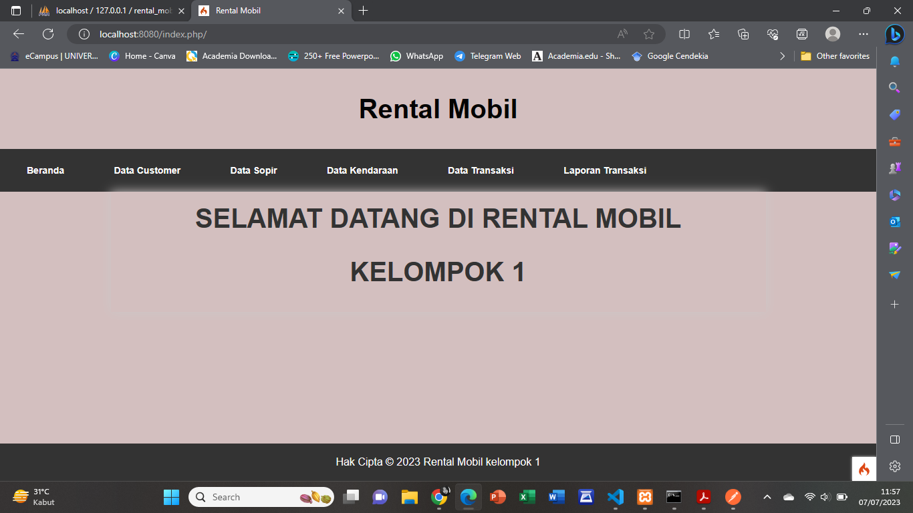
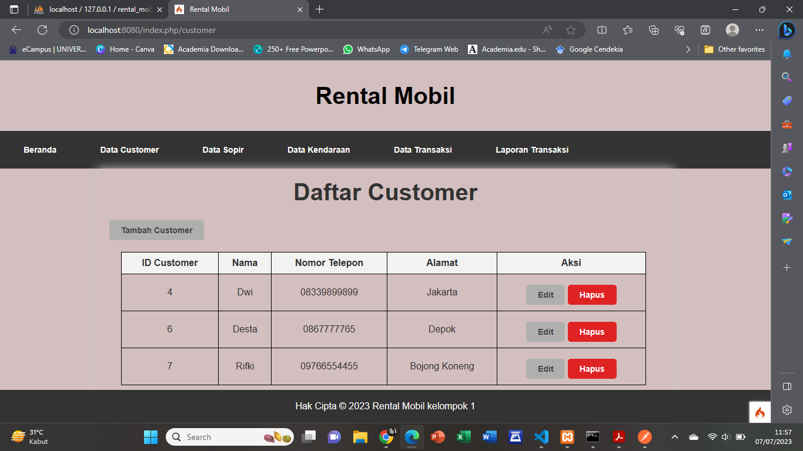
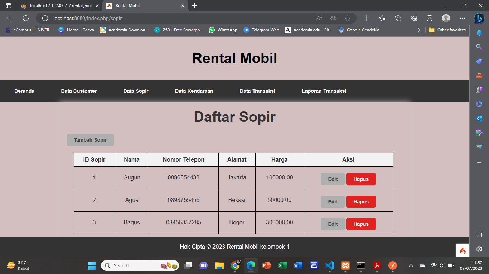
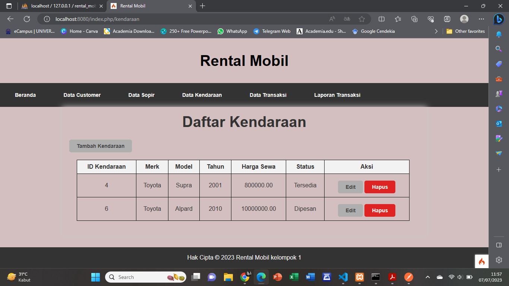
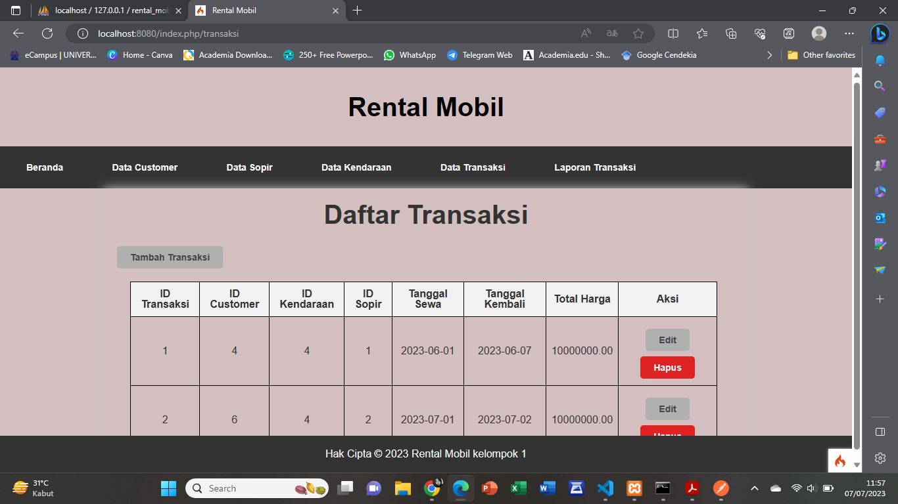
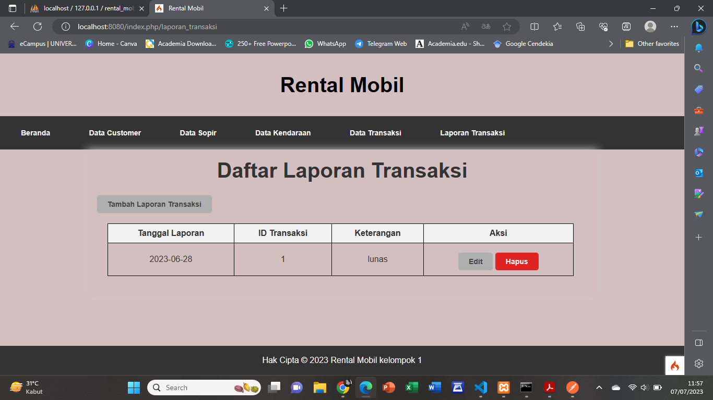

# Aplikasi Rental Mobil

## Kelompok 1 - TI.21.A.1

| NIM             | Nama                         |
| --------------- | ---------------------------- |
| **31210205**    | Muhammad Rifki               |
| **31210388**    | Muhammad Alwi Nur Fathihah   |
| **31210180**    | Ade Maulani Bilgis           |
| **31210182**    | Silvia Delya Heryani         |
| **31210142**    | Modesta Liunesi              |

## Rancangan Basis Data

## Implementasi Code PHP menggunakan CodeIgniter 4

* Membuat Routes.php
* 

## Tampilan Aplikasi

Pada tampilan aplikasi ini, terdapat menu beranda, data cutomer, data sopir, data kendaraan, data transaksi, dan laporan transaksi.

### 1. Menu Beranda

Untuk mengakses menu beranda ketikkan http://localhost:8080/index.php/ pada browser, tampilannya akan seperti berikut:

### 2. Menu Data Customer

* Untuk mengakses menu beranda ketikkan http://localhost:8080/index.php/customer pada browser atau klik pada menu data customer, tampilannya akan seperti berikut:

  
  

* Jika ingin menambahkan data customer klik tambah customer, lalu jika ingin menghapus daftar nama customer klik hapus dan jika ingin mengedit klik edit.

### 3. Menu Data Sopir

* Untuk mengakses menu beranda ketikkan http://localhost:8080/index.php/sopir pada browser atau klik pada menu data sopir, tampilannya akan seperti berikut:

  

* Jika ingin menambahkan data sopir klik tambah customer, lalu jika ingin menghapus daftar nama customer klik hapus dan jika ingin mengedit klik edit.

### 4. Menu Data Kendaraan

* Untuk mengakses menu beranda ketikkan http://localhost:8080/index.php/kendaraan pada browser atau klik pada menu data kendaraan, tampilannya akan seperti berikut:

  
  

* Jika ingin menambahkan data sopir klik tambah customer, lalu jika ingin menghapus daftar nama customer klik hapus dan jika ingin mengedit klik edit.

### 5. Menu Data Transaksi

* Untuk mengakses menu beranda ketikkan http://localhost:8080/index.php/kendaraan pada browser atau klik pada menu data transaksi, tampilannya akan seperti berikut:

  
  

* Jika ingin menambahkan data sopir klik tambah customer, lalu jika ingin menghapus daftar nama customer klik hapus dan jika ingin mengedit klik edit.

### 6. Menu Data Laporan Transaksi

* Untuk mengakses menu beranda ketikkan http://localhost:8080/index.php/laporan_transaksi pada browser atau klik pada menu data laporan transaksi, tampilannya akan seperti berikut:

   

* Jika ingin menambahkan data sopir klik tambah customer, lalu jika ingin menghapus daftar nama customer klik hapus dan jika ingin mengedit klik edit.

## Link Youtube

Berikut link youtube kelompok kami : [Kelompok 1]()

## Link Web Hosting

Berikut link web hosting kelompok kami : [Kelompok 1]()

## Terima Kasih!
