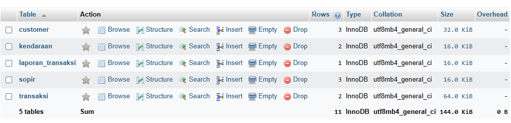
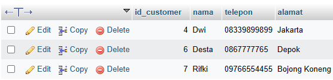
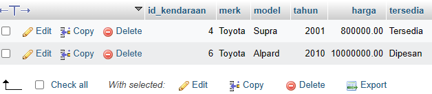
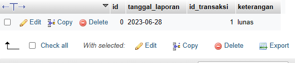
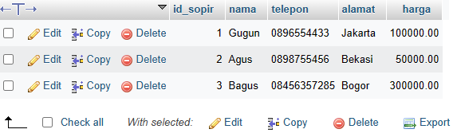
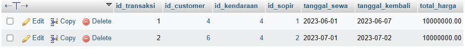
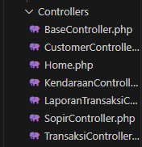
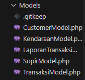
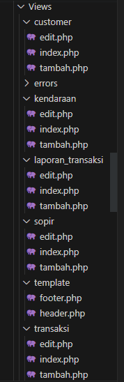

# Aplikasi Rental Mobil

## Kelompok 1 - TI.21.A.1

| NIM             | Nama                         |
| --------------- | ---------------------------- |
| **312110205**   | Muhammad Rifki               |
| **312110388**   | Muhammad Alwi Nur Fathihah   |
| **312110180**   | Ade Maulani Bilgis           |
| **312110182**   | Silvia Delya Heryani         |
| **312110142**   | Modesta Liunesi              |

## Rancangan Database

* Kami membuat database dengan nama **rental_mobil**, pada database tersebut terdapat beberapa tabel diantaranya seperti pada gambar berikut:
  
  

* Tabel yang pertama adalah **tabel customer**, di dalam tabel customer terdapat beberapa atribut yaitu: **id_customer, nama, telepon, dan alamat**. Tabel ini untuk menyimpan data customer rental mobil.
  
  
  
* Tabel selanjutnya adalah **tabel kendaraan**, pada tabel ini semua data kendaraan akan disimpan. Atributnya terdiri dari: **id_kendaraan, merk, model, tahun, harga, dan tersedia**.

  
  
* Pada **tabel laporan transaksi** terdapat beberapa atribut yaitu: **id, tanggal_laporan, id_transaksi, keterangan**. Tabel ini untuk menyimpan data laporan transaksi yang sudah atau yang belum diproses.

  
  
* Tabel selanjutnya adalah **tabel sopir**, tabel ini berisi data sopir beserta identitas dan harga jasanya. Atribut tabel ini terdiri dari seperti di bawah ini:

  
  
* Tabel terakhir adalah **tabel transaksi**, atribut tabel ini teridiri dari: **id_transaksi, id_customer, id_kendaraan, id_sopir, tanggal_sewa, tanggal_kembali, dan total_harga**.

  

## Implementasi Code PHP menggunakan CodeIgniter 4

* Membuat **Routes.php**, routes ini berfungsi untuk mengatur arah atau rute dari request untuk menentukan fungsi atau bagian mana yang akan memproses request tersebut. Pada aplikasi yang kami buat, kami menggunakan kode `$routes->get('/', 'Home::index');` untuk menampilkan halaman utama. Untuk mengakses halaman yang lain, kami menambahkan routes sesuai dengan controller. 
  
* Selanjutnya membuat controller, controller adalah class atau script yang bertanggung jawab merespon sebuah request. Pada Codeigniter, request yang diterima oleh file index.php akan diarahkan ke router untuk kemudian oleh router tesebut diarahkan ke controller. Pada aplikasi yang kami buat, kami menambahkan controller untuk sopir, transaksi, laporan transaksi, dan customer.

  

* Kemudian membuat model untuk memproses data customer, transaksi, sopir, kendaraan, dan laporan transaksi.

  
  

* Setelah model dibuat, kami membuat view untuk mengelola tampilan. Strukturnya seperti di bawah ini:

  

  
## Tampilan Aplikasi

Pada tampilan aplikasi ini, terdapat menu beranda, data customer, data sopir, data kendaraan, data transaksi, dan laporan transaksi.

### 1. Menu Beranda

Untuk mengakses menu beranda ketikkan http://localhost:8080/index.php/ pada browser, tampilannya akan seperti berikut:

  

### 2. Menu Data Customer

* Untuk mengakses menu beranda ketikkan http://localhost:8080/index.php/customer pada browser atau klik pada menu data customer, tampilannya akan seperti berikut:

  
  

* Jika ingin menambahkan data customer klik tambah customer, lalu jika ingin menghapus daftar nama customer klik hapus dan jika ingin mengedit klik edit.

### 3. Menu Data Sopir

* Untuk mengakses menu beranda ketikkan http://localhost:8080/index.php/sopir pada browser atau klik pada menu data sopir, tampilannya akan seperti berikut:

  

* Jika ingin menambahkan data sopir klik tambah customer, lalu jika ingin menghapus daftar nama customer klik hapus dan jika ingin mengedit klik edit.

### 4. Menu Data Kendaraan

* Untuk mengakses menu beranda ketikkan http://localhost:8080/index.php/kendaraan pada browser atau klik pada menu data kendaraan, tampilannya akan seperti berikut:

  
  

* Jika ingin menambahkan data sopir klik tambah customer, lalu jika ingin menghapus daftar nama customer klik hapus dan jika ingin mengedit klik edit.

### 5. Menu Data Transaksi

* Untuk mengakses menu beranda ketikkan http://localhost:8080/index.php/kendaraan pada browser atau klik pada menu data transaksi, tampilannya akan seperti berikut:

  
  

* Jika ingin menambahkan data sopir klik tambah customer, lalu jika ingin menghapus daftar nama customer klik hapus dan jika ingin mengedit klik edit.

### 6. Menu Data Laporan Transaksi

* Untuk mengakses menu beranda ketikkan http://localhost:8080/index.php/laporan_transaksi pada browser atau klik pada menu data laporan transaksi, tampilannya akan seperti berikut:

   

* Jika ingin menambahkan data sopir klik tambah customer, lalu jika ingin menghapus daftar nama customer klik hapus dan jika ingin mengedit klik edit.

## Link Youtube

Berikut link youtube kelompok kami : https://youtu.be/CAuVwWZUfZo

## Link Web Hosting (Demo Program)

Berikut link web hosting kelompok kami : http://rentalmobil.my.to/

## Terima Kasih!
